<!--
  Profile README for github.com/sudeshkar
  Every activity card below is generated by .github/workflows/profile-cards.yml
  and committed into assets/ — see "How this README stays up" at the end.
-->

<p align="center">
  <picture>
    <source media="(prefers-color-scheme: dark)" srcset="assets/header-dark.svg">
    <source media="(prefers-color-scheme: light)" srcset="assets/header-light.svg">
    
  </picture>
</p>

<p align="center">
  <a href="https://portfolio-v3-chi-cyan.vercel.app/"></a>
  <a href="https://www.linkedin.com/in/sathieskumar-sudeshkar"></a>
  <a href="mailto:sudeshkar008sk@gmail.com"></a>
  <a href="https://medium.com/@sudeshkar008sk"></a>
  <a href="https://leetcode.com/u/sudeshkar/"></a>
  <a href="https://www.geeksforgeeks.org/profile/sudeshkah7lq"></a>
</p>

---

## About

I'm a full-stack engineer in Sri Lanka who spends most of the day on the server side — **Java 21 / Spring Boot**, **C# / ASP.NET Core**, and the **React + TypeScript** interfaces that sit on top of them.

BSc (Hons) Software Engineering, Second Class Upper, from **Cardiff Metropolitan University** (Dec 2025). Currently a **Full Stack Developer Trainee at Variosystems**, building internal business tooling with Blazor WebAssembly and ASP.NET Core.

Alongside that I contribute to **[OpenMRS](https://openmrs.org)** — an open-source electronic medical record platform run by health systems in 40+ countries. Working inside a codebase that size taught me more about review standards, migrations and micro-frontend architecture than any tutorial could.

What I actually care about: **layered architecture**, REST APIs that are boring to consume, and concurrency bugs caught by a test rather than by a customer.

<p align="center">
  <picture>
    <source media="(prefers-color-scheme: dark)" srcset="assets/stats-dark.svg">
    <source media="(prefers-color-scheme: light)" srcset="assets/stats-light.svg">
    
  </picture>
</p>

---

## Open source — OpenMRS

Six merged pull requests into the OpenMRS platform, across the Java core and the O3 React/TypeScript micro-frontend ecosystem.

| PR | Repository | Type | What it did |
| :--- | :--- | :--- | :--- |
| [#3525](https://github.com/openmrs/openmrs-esm-patient-chart/pull/3525) | `openmrs-esm-patient-chart` | 🐛 Bug fix | Made the Vitals & Biometrics tables sort in the direction the header arrow actually points |
| [#6391](https://github.com/openmrs/openmrs-core/pull/6391) | `openmrs-core` | ⚡ Enhancement | Swapped `UUID.randomUUID()` for `java-uuid-generator` — faster, collision-resistant entity IDs |
| [#1734](https://github.com/openmrs/openmrs-esm-core/pull/1734) | `openmrs-esm-core` | 🐛 Bug fix | Corrected Login Location tag filtering in the shared `useLocationCount` hook |
| [#2521](https://github.com/openmrs/openmrs-esm-patient-management/pull/2521) | `openmrs-esm-patient-management` | 🧹 Code quality | Enforced the strict-equality (`eqeqeq`) lint rule across the module |
| [#250](https://github.com/openmrs/openmrs-esm-admin-tools/pull/250) | `openmrs-esm-admin-tools` | 📝 Docs | Documentation fix |
| [#255](https://github.com/openmrs/openmrs-esm-template-app/pull/255) | `openmrs-esm-template-app` | 📝 Docs | Clearer setup instructions for new contributors |

> Working across federated modules meant getting hands-on with OAuth2 / JWT auth flows, the Carbon Design System, and the review standards of a project with real patients downstream.

---

## Selected work

<table>
<tr>
<td width="50%" valign="top">

### 🐟 [FreshLink — B2B backend](https://github.com/sudeshkar/FreshLink-Backend)

A Spring Boot REST API replacing phone-and-WhatsApp fish ordering in Kandy with a structured marketplace and a tracked order lifecycle.

`Java 21` `Spring Boot 4` `PostgreSQL` `Flyway` `Docker`

- **Concurrency-safe stock** via an optimistic-locking version column — proven by a test where, without it, two 60 kg orders against 100 kg of stock both succeed
- **Demand-matching engine** ranking supply by freshness then supplier rating, re-running every 10 minutes and expiring matches a supplier never answers
- Three-role access model enforced in the service layer, JWT with rotating refresh tokens, **99 passing tests**

[Frontend ↗](https://github.com/sudeshkar/FreshLink-Frontend) · [Write-up ↗](https://medium.com/@sudeshkar008sk/i-got-to-the-fish-market-too-late-so-i-built-a-backend-ca8b8b8d623e)

</td>
<td width="50%" valign="top">

### 🧠 [AI-Powered Focus Assistant](https://github.com/sudeshkar/AI-Powered-Focus-Assistant)

Final-year project. A desktop app that learns your focus pattern and recommends break schedules instead of guessing at them.

`C#` `WPF` `MVVM` `Python` `Q-Learning`

- Q-table reinforcement-learning agent trained on **6 behavioural metrics**
- Python model wired to the C# app over IPC, ~200 ms per session cycle
- MVVM throughout, so the policy is swappable without touching the UI

</td>
</tr>
<tr>
<td width="50%" valign="top">

### ♻️ [Smart Waste Management](https://github.com/sudeshkar/wastemanagement)

An IoT-fed waste-collection platform for Sri Lanka — scheduling, reporting and driver assignment — built in an Agile team of four.

`Java` `Spring Boot` `React` `JWT` `Docker`

- **15+ REST endpoints** behind interface-based service contracts
- Role-based dashboards with JWT auth and real-time collection data
- Persistence kept fully decoupled from presentation

[Frontend ↗](https://github.com/sudeshkar/SMW_frontend)

</td>
<td width="50%" valign="top">

### 🎛️ [Portfolio v3](https://github.com/sudeshkar/portfolio-v3)

My current portfolio — and a small exercise in making a static site behave like a live one.

`React 19` `Vite` `Tailwind v4` `three.js` `Framer Motion`

- WebGL hero and scroll-linked motion, with a full reduced-motion path
- Projects load from a **Google Apps Script + Sheets** backend, with cache and snapshot fallbacks so the page never renders empty
- [**Live ↗**](https://portfolio-v3-chi-cyan.vercel.app/)

</td>
</tr>
</table>

<sub>Also on the shelf: <a href="https://github.com/sudeshkar/introvert-extrovert-prediction">personality prediction with XGBoost</a> · <a href="https://github.com/sudeshkar/Titanic-Servival-Prediction-Model">Titanic survival model</a> · <a href="https://github.com/sudeshkar/my-portfolio">macOS-inspired portfolio</a></sub>

---

## Toolkit

<table>
<tr><td><b>Languages</b></td><td>


</td></tr>
<tr><td><b>Backend</b></td><td>


</td></tr>
<tr><td><b>Frontend</b></td><td>


</td></tr>
<tr><td><b>Data</b></td><td>


</td></tr>
<tr><td><b>Tooling</b></td><td>


</td></tr>
</table>

`Clean architecture` · `SOLID` · `REST & DTO design` · `Micro-frontends` · `Agile / Scrum`

---

## Experience

**Full Stack Software Developer Trainee** — *Variosystems* · 2025 → present

- Built internal workspace tooling in **Blazor .NET WebAssembly** with component-based architecture and MVVM, streamlining 3+ internal workflows
- Delivered features end-to-end — Blazor components through to **ASP.NET Core** services and data access
- Improved UI responsiveness with WebAssembly lazy-loading; shipped 2 feature modules on schedule across Agile sprints

**Open Source Contributor** — *OpenMRS* · 2025 → present

- Six merged PRs across `openmrs-core`, `esm-core`, `patient-chart`, `patient-management`, `admin-tools` and `template-app`
- Worked inside federated micro-frontends, OAuth2 / JWT auth flows and the Carbon Design System

**BSc (Hons) Software Engineering — Second Class Upper** — *Cardiff Metropolitan University* · graduated Dec 2025

- Final-year project: a reinforcement-learning focus assistant
- Team lead across Agile group projects delivering full-stack platforms

---

## Activity

<p align="center">
  <picture>
    <source media="(prefers-color-scheme: dark)" srcset="assets/languages-dark.svg">
    <source media="(prefers-color-scheme: light)" srcset="assets/languages-light.svg">
    
  </picture>
  <picture>
    <source media="(prefers-color-scheme: dark)" srcset="assets/rhythm-dark.svg">
    <source media="(prefers-color-scheme: light)" srcset="assets/rhythm-light.svg">
    
  </picture>
</p>

<p align="center">
  <picture>
    <source media="(prefers-color-scheme: dark)" srcset="assets/activity-dark.svg">
    <source media="(prefers-color-scheme: light)" srcset="assets/activity-light.svg">
    
  </picture>
</p>

<p align="center">
  <picture>
    <source media="(prefers-color-scheme: dark)" srcset="https://raw.githubusercontent.com/sudeshkar/sudeshkar/output/snake-dark.svg">
    <source media="(prefers-color-scheme: light)" srcset="https://raw.githubusercontent.com/sudeshkar/sudeshkar/output/snake-light.svg">
    
  </picture>
</p>

---

## Writing

- **[I Got to the Fish Market Too Late. So I Built a Backend.](https://medium.com/@sudeshkar008sk/i-got-to-the-fish-market-too-late-so-i-built-a-backend-ca8b8b8d623e)** — how a late Sunday in Kandy became FreshLink, and the concurrency bugs, IDOR fixes and rollback gotchas that 99 tests caught along the way
- **[Building a Serverless REST API with Google Apps Script and Google Sheets](https://medium.com/@sudeshkar008sk/building-a-serverless-rest-api-with-google-apps-script-and-google-sheets-568567b3a905)** — serverless architecture, REST design and GCP integration, and the backend that still powers my portfolio's project feed

---

<details>
<summary><b>How this README stays up</b></summary>

<br>

Every card on this page is an SVG in [`assets/`](assets), rendered by [`scripts/generate-cards.mjs`](scripts/generate-cards.mjs) and committed by [a scheduled workflow](.github/workflows/profile-cards.yml).

That is deliberate. The usual profile cards — `github-readme-stats`, `github-profile-summary-cards`, activity graphs — run on a shared public deployment against a shared API rate limit. When it is exhausted the card returns an error, GitHub's image proxy caches that error, and the activity section sits empty for hours. Nothing on your side broke; you just queued behind everyone else.

So this pipeline moves the work to build time:

| Stage | What happens |
| :--- | :--- |
| **Fetch** | `scripts/data.mjs` queries the GitHub GraphQL API with the workflow's own `GITHUB_TOKEN` — this repo's rate limit, not a shared one |
| **Fall back** | The response is written to `assets/data.json`; if a run fails, cards re-render from the last good snapshot instead of blanking |
| **Render** | `scripts/cards/*.mjs` emit light and dark SVGs with CSS keyframe animation and a `prefers-reduced-motion` path |
| **Serve** | The SVGs live in this repo, so loading the page hits no third-party service at all |

Refreshes every six hours, and on any push to `scripts/`. To run it locally:

```bash
GITHUB_TOKEN=$(gh auth token) node scripts/generate-cards.mjs
```

</details>

---

<p align="center">
  <b>Open to graduate and full-stack software engineer roles — remote or Sri Lanka based.</b><br>
  <a href="mailto:sudeshkar008sk@gmail.com">sudeshkar008sk@gmail.com</a> ·
  <a href="https://www.linkedin.com/in/sathieskumar-sudeshkar">LinkedIn</a> ·
  <a href="https://portfolio-v3-chi-cyan.vercel.app/">portfolio</a>
</p>
